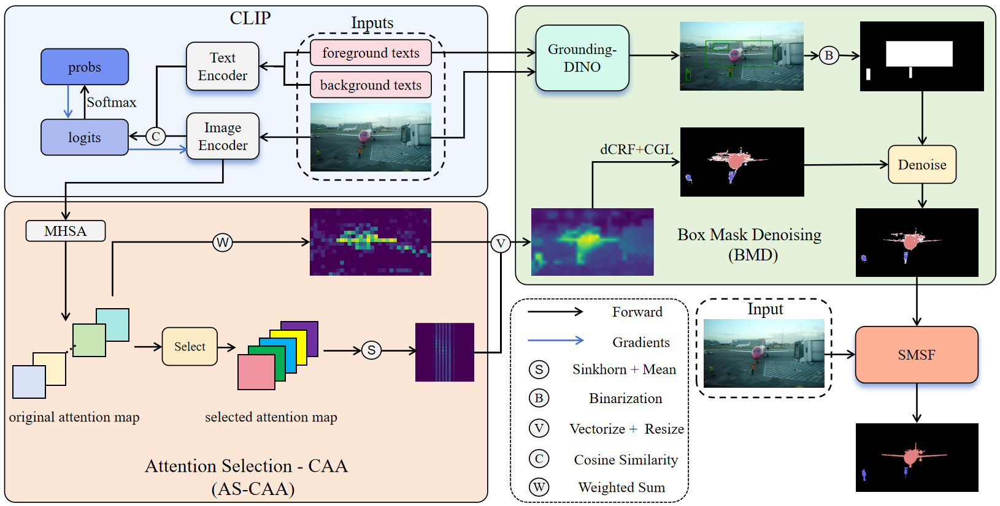

# CLIP is Also an Efficient Segmenter: A Text-Driven Approach for Weakly Supervised Semantic Segmentation (CVPR 2023)




## Reqirements

```
# create conda env
conda create -n wintn-csg python=3.9
conda activate wintn-csg

# install packages
pip install torch==1.7.1+cu101 torchvision==0.8.2+cu101 -f https://download.pytorch.org/whl/torch_stable.html
pip install opencv-python ftfy regex tqdm ttach tensorboard lxml cython

# install pydensecrf from source
git clone https://github.com/lucasb-eyer/pydensecrf
cd pydensecrf
python setup.py install
```

## Preparing Datasets
### PASCAL VOC2012
Download images in PASCAL VOC2012 dataset at [here](http://host.robots.ox.ac.uk/pascal/VOC/voc2012/) and the train_aug groundtruth at [here](http://home.bharathh.info/pubs/codes/SBD/download.html).
The structure of `/your_home_dir/datasets/VOC2012`should be organized as follows:

```
---VOC2012/
       --Annotations
       --ImageSets
       --JPEGImages
       --SegmentationClass
       --SegmentationClassAug
```

### MS COCO2014
Download MS COCO images from the [official website](https://cocodataset.org/#download).
Download semantic segmentation annotations for the MS COCO dataset at [here](https://drive.google.com/file/d/1pRE9SEYkZKVg0Rgz2pi9tg48j7GlinPV/view?usp=sharing).
The structure of `/your_home_dir/datasets/COCO2014`are suggested to be organized as follows:
```
---COCO2014/
       --Annotations
       --JPEGImages
           -train2014
           -val2014
       --SegmentationClass
```

### Preparing pre-trained model
Download CLIP pre-trained [ViT-B/16] at [here](https://openaipublic.azureedge.net/clip/models/5806e77cd80f8b59890b7e101eabd078d9fb84e6937f9e85e4ecb61988df416f/ViT-B-16.pt) and put it to `/your_home_dir/pretrained_models/clip`.

## Usage
### Coming soon...
```
